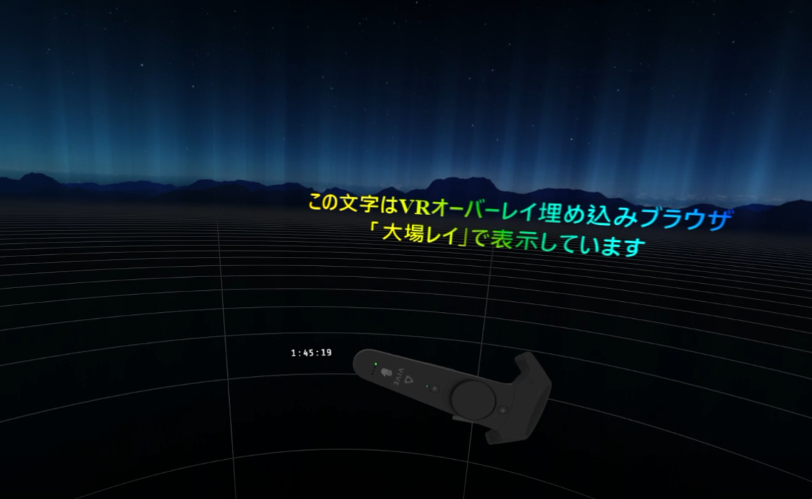

# 大場レイ
VR空間上にブラウザを埋め込み、オーバーレイで表示するツールです。

# 使い方
releaseよりダウンロードしてください

表示の設定は、Configフォルダ内のdisplays.jsonファイルに定義されています。
各自の使い方に併せてカスタムし、SteamVRを"起動後"にOhbaLay.exeを実行してください。

# 必要環境
- Windows 10
- SteamVR

# もう少し詳しく
内部的にChromium v81ブラウザを実行し、そのレンダリング結果をVR空間上に投影します。

VRオーバーレイという機能を用いるため、現在起動しているVRアプリケーションに関わらず、表示できます。
デモとして次の2つがデフォルトで表示する設定になっています

- くそでかゲーミング大場レイ文字
- 左手にデジタル時計

内部動作はブラウザなので、ローカルのHTMLファイル、Web上のサイトの他、画像や動画を表示することも可能です。

現在ブラウザの操作、フォームの入力やクリック、画面のスクロールなどには対応していません。
VRアプリケーションの操作と競合しない入力方法が確立できていないためです。

JSONのフォーマットなどは[How To Use](./HowToUse/)をご覧ください。

まだ開発版ですので、床に小さく "大場レイ#開発版" と表示されます。ご了承ください。

# 連絡先
Twitter: ixsiid

